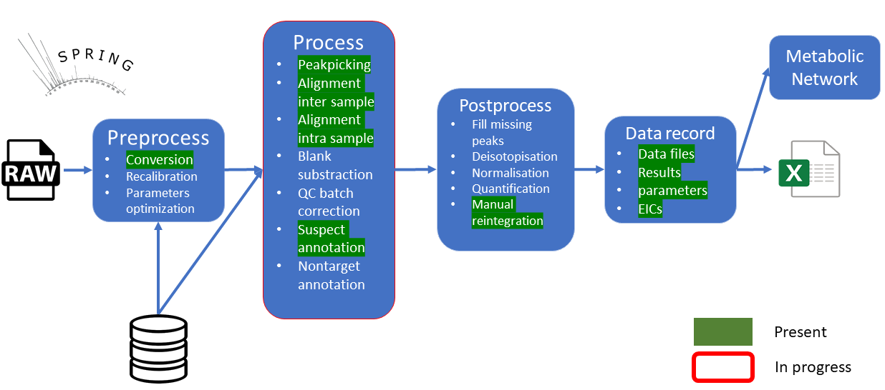
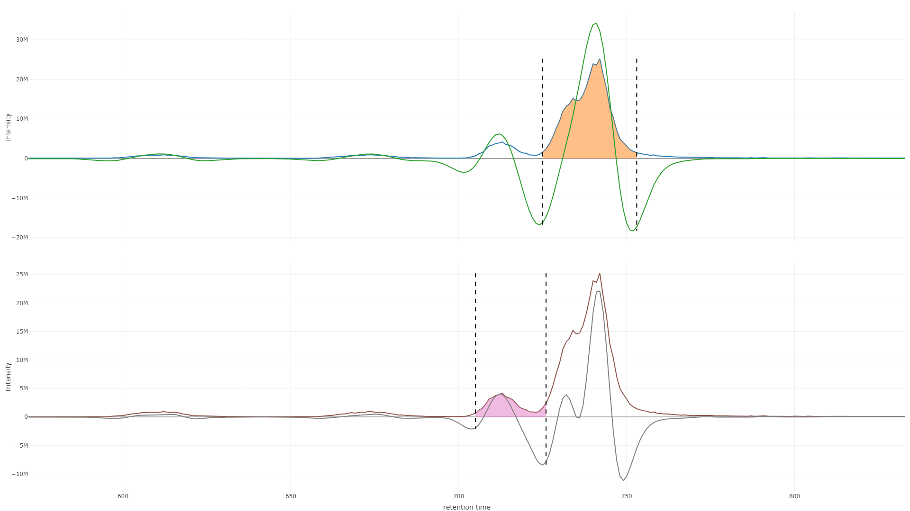
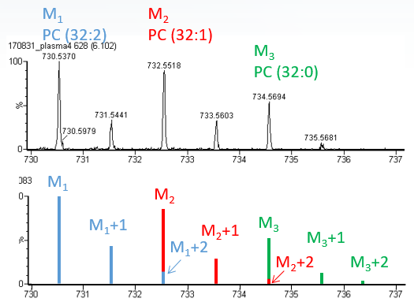

# SPRING
This repository contain the files to launch SPRING as en executable on Windows platform without administrative rights. It contains already all the files required to launch the app. 

## Workflow
The workflow of the tool was designed to annotate LC-GC/MS data directly from raw files in order to get a report file with all chemical entities detected. Some steps today are not finalized (the tool is not finished) but allow anyway to report all compounds found (they are not critical or required steps).


### Conversion
The files are converted in an mzXML format in a defined polarity, using msConvert, a software produced by ProteoWizard (Chambers et al., 2012). Some Microsoft files are mandatory to make it work ([Microsoft .NET Framework 4.0](http://www.microsoft.com/download/en/details.aspx?id=17851) or higher installed).
In case of dual Pos/Neg files, it is advised to create two distinct projects.
The data are also automatically centroided, in order to “lighten” data. The user is also allowed to import already centroided file(s) in the most common format (*.mzXML, *.mzML, *.CDF). These files are checked for centroided and readable data. Import of non-centroided mzXML files does not work.
Why centroid MS data? Because a peak in profile mode contains too much information that the software cannot use for the moment (and it will be too hard to work with). Thus, each peak will be displayed as discrete m/z with zero line widths. For that, msConvert includes most of the manufacturers’ algorithms.

### Recalibration & contaminants removal
Some tools allows the recalibration of m/z data by looking at m/z knowns like contaminants. Then they remove them. The major default is that they need a predefined list.
OptiLCMS do it as a nontarget way: it round all m/z at 2 digits & then keep only those which are present in 75% of all the scans for a file. Then it simply remove them. I test the concept by rounding the m/z to 3 digits but no redondant m/z where founded. Maybe someone will have a better suggestion ?
### Parameters optimization
Three tools today allow to optimize parameters used for all the process workflow: Autotuner, IPO & OptiLCMS. The first one try to find the nth most intense ion & try to guess the parameters `ppm` & `peakwidth` required to extract them. IPO use design of experiments to guess all the parameters: for a processing step it run it x times & then optimize the parameters according the number of M+1 it found (it use in background CAMERA to identify them). But the data used to test it seems to be too big & required a processing time really huge...
For OptiLCMS it only merge some parts of autotuner & the design of experiments of IPO to work so the problem stay the same.
I work on a script really inspired from IPO but with two major points: 
 - lighten the data in order to keep only isotopologues from internal standards, in that way the processing time will be less;
 - compute the score of optimization not on the ratio of M+1 founded with M but on how the isotopic profiles of internal standards are extracted (number & quality of isotopologues foreach internal standards retrieve)
 Even with that the process is too long and the ppm guessed is often out of range (more than 45ppm ?!!). Something is wrong but no time to investigate...
### Peakpicking
The peak-picking step permits the detection of chromatographic peaks in  files. For each extracted signal (so-called “feature”), it provides a centroid m/z, a retention time and an intensity. This process is performed thanks to the centWave algorithm of the xcms package without the “predict isotope ROIs” functionality. 
About the process itself, xcms first searches for so-called “m/z Regions Of Interest” (ROI) which correspond to a m/z detected along several scans with a ppm tolerance. The parameters used for this step are a m/z tolerance (ppm), a prefilter step and a prefilter level. The prefilter step represents the number of mass traces with a m/z tolerance in consecutive scans and prefilter level an intensity threshold. Once done, wavelets transformation are used over the ROIs to find peaks. Several passes of wavelets are used until the best “fit” is found. Two parameters can be set. Peakwidth corresponds to the retention time window to use (minimum and maximum). Snthresh corresponds to a signal to noise ratio cutoff. For more informations please refer to the xcms package documentation.


### Alignment inter sample
For this step a retention time adjustment is performed using the OBI-Warp algorithm.
In a second step, the density distribution of the peaks is calculated along the retention time axis and peaks from the same or different samples that are close to each other are grouped using the density function of the xcms package. 

### Alignment intra sample
Four actions are processed:
 - Group all peaks which eluate at the same time-point, defined as the retention time ± full width at half maximum (FWHM). This FWHM of a peak is defined as the standard deviation * 2.35 (the peak is assumed as normally distributed);
 - Partition those groups according to their chromatographic peak shape correlations. It performs all extracted ion chromatogram (EIC) correlations between peaks in one group inside a sample and separates them with a graph clustering method (Highly Connected Subgraphs approach or Label Propagation Community Algorithm);
 - annotate peaks which corresponds to the M+1 (difference of m/z corresponds to the mass difference between a <sup>12</sup>C and a <sup>13</sup>C);
 - annotate peaks according their m/z difference with a list of adducts.

For this step the package CAMERA is used but with some modifications: some functions use now the BiocParallel functions to parallelize most of the step described above (see my fork on GitHub). Those functions are : 
 - getAllPeakEICs
 - groupCorr
 - findAdducts
 - annotateDiffreport

Even with those modifications CAMERA seems to be taking too much time, maybe parallelizing the function <code>calcPC</code> could help but it looks a nightmare to do it... 
Maybe looking at the tools <i>cliqueMS</i> or <i>RamClustR</i> could help (they use as input directly <i>xcmsSet</i>, how convenient !)

### Blank substraction
No explanation needed. Therefore instead of removing peaks that appear in blanks some rules can be defined to keep peaks that have a higher intensity in samples for example (keep peaks which are not present in blanks or have an intensity superior to the mean intensity of the same peak identified in blanks).
### QC batch correction
See how they did this step in W4M. Better to not reinvent the wheel.
### Suspect annotation
This step was designed to annotate the pcgroups obtained by CAMERA (a pcgroup contains peaks wich belong to the same compound). For that it use an internal database with some informations: 
 - compound class;
 - majoritary adduct (adduct majoritary seen for the compound)
 - name;
 - formula;
 - retention time.

With that informations, the script computes all theoretical isotopic profiles thanks to the package EnviPat and compare it to all pcgroups.

### Nontarget annotation
Even with the use of a database to identify peaks there will be a lot of unknown signals. Two ways are possible to annotate them with at least an ion formula : 
 - if the peaks belongs to a pcgroup with peaks identified with an ion formula we can decompose the m/z difference between them in order to perhaps identify a fragment or a neutral loss ? 
 - we can try also to identify homologues by looking at the mass defect (CAMERA propose already a function named <code>findKendrickMasses</code>
 - another idea could be to just decompose the most intense m/z in a pcgroup to obtain an ion formula & try to recover the neutral formula by looking at the m/z difference of the peaks in the same pcgroup (see HaloSeeker)


### Fill missing peaks
This step is often placed just after the aligment inter sample, for that xcms (for example) try to integrate peaks that are missing in some files. For that it simply look at a precise m/z and rT range and integrate the signals, even if there is nothing but noise...
This step could be executed just after the annotation in order to integrate only missing peaks annotated in other samples in order to reduce the noise.
### Deisotopisation
It appears that the large isotopic profiles of lipids can overlap between them. So behind a peak two or more ions can be hidden ! To correct & retrieve the good intensities we need to sort the list of peaks according their m/z & rT, then correct for each isotopologues their intensities by taking advantages of their annotations (if available) and their theoretical isotopic profile.


### Normalisation
...
### Quantification
...
### Manual reintegration
Sometimes the peakpicking step doesn't integrate perfectly a peak on the rT dimension so the area reported can be false. A manual reintegration is required in this case.
### Data record
A lot of informations are recorded. For that we use the structure of an sqlite database to taking advantages of the relationship system. 
Also to accelerate the visualisation of EICs some info are recorded by advance: for each basepeak the EIC foreach file is computed & stored in the sqlite database.
An advantage also to use an sqlite database for recording all data for a project is that it is in a form of a single file. Easier to move & store.

Multiple tables are present: 
 - ann: each row represent a compound, the last fields depends on the number of files processed: each field correspond to a file & it's fill with the corresponding spectra id;
 - spectra_infos: each row represent one spectra with informations like the score, number of peak matched...
 - spectras: contains all the peaks for each spectra, useful when we want to display peaks which matched with the theoretical one
 - peaks: the original peaktable exported by XCMS
 - peakgroups: the original table exported by XCMS after the inter alignment of the files
 - eic: contain all eic of all basepeaks, the last fields represent the intensities for this basepeak in all the files aligned
 - mzmat: same that the eic table but with the m/z
 - *_params: contains only one line with all the parameters used for the processing

## Structure
### Structure of the Windows app
```
.
├── R-Portable            # A portable R application that can be found here : https://portableapps.com/node/32898
│   └── ...
├── Rtools                # Rtools, needed to create excel files or compiling cpp scripts
│   └── ...
├── SPRING                # R package, see below for the structure of it
│   └── ...
├── pwiz                  # Proteowizard repository containing files used to convert LC-GC/MS files
│   └── ...
├── renv                  # renv directory, used to manage library paths in order to isolate R dependencies. See https://rstudio.github.io/renv/articles/renv.html
│   ├── .gitignore
│   ├── activate.R        # activation script created by renv
│   └── settings.dcf      # project settings (created by renv)
├── .gitignore
├── SPRING.ico
├── click_me.vbs          # vbs file, it launch an R script with the R-Portable executable
├── renv.lock             # lock file needed for renv, it describe all the R package used to launch the app
└── rscript.R             # R script used to launch SPRING: first it install/load all packages needed with renv, then it build the package SPRING (some cpp files need compilation... no idea for now how to bypass this step) & launch the app by using the function `run_shiny_app()`
```

### Structure of the SPRING package
```
SPRING
├── R                             # contains all R code files 
    └── ...
├── inst                          # contains internal data
    ├── extdata
    |   ├── database              # repository containing all databases used by SPRING
    |   |   ├── global.csv        # database of lipids, see the section `Database`
    |   |   ├── test-neg.csv      # database only used for testing the package
    |   |   └── test.csv          # database only used for testing the package
    |   └── adducts.csv           # list of adducts, it is an aggregation of the lists of EnviPat & CAMERA R package
    ├── shiny_app                 # shiny app directory
    |   ├── server                # contains all files needed for the server side of the shiny app
    |   |   └── ...
    |   ├── tests                 # repository used to test the app with the shinytest package (which used phantomJS, a headless web browser)
    |   |   └── ...
    |   ├── ui                    # contains all files needed for the interface side of the shiny app
    |   |   └── ...
    |   ├── www
    |   |   ├── SPRING.css
    |   |   └── SPRING.js
    |   ├── server.R              # server file of the shiny app, it will call all the different files of the server directory
    |   └── ui.R                  # interface file of the shiny app, it will call all the different files of the interface directory
    └── testdata                  # contains only data files used to test the package
    |   └── ...
├── man                           # contains documentation for the package functions
    └── ...
├── src                           # contains cpp files used by the package, see the Rcpp package for more information
    └── ...
├── tests                         # testing directory used by the testthat package
    └── ...
├── .Rbuildignore
|── DESCRIPTION
├── LICENSE.md
├── NAMESPACE
└── README.md
```

## INSTALLATION
### Windows
SPRING contains its own R executable and all R package dependencies are managed with the renv package but it only works on Windows.
Just download/clone it. If you want to install it on your own R session see the sub section below.
### Other OS 
To use it on Linux or Mac you need to launch R & install the SPRING package by specifying the path to the SPRING package:
```r
install.packages("path_to_SPRING/SPRING", repos = NULL, type="source")
```

## USAGE 
### WINDOWS
To launch the app you only need to click on the file named "click_me.vbs". 
### Other OS
To use it on Linux or Mac you need to call the function & specifying the path to the proteowizard repository: 
```r
SPRING::run_shiny_app(pwiz = "~/Proteowizard 4.7.1/pwiz")
```
You can call the function without specifying the pwiz argument but the app will don't allow the conversion in that case (it will stop the workflow if your files are not in the format *mzXML*, *mzML* or *CDF*).

## Command line documentation
### Launch workflow
Before launching the workflow we must create different objects which will contains all different parameters for the processing.
```r
# correspond to the parameters of xcms for the function `findChromPeaks`
# please refer to the documentation of xcms to adjust them
cwt_params <- xcms::CentWaveParam(
        ppm = 30,
        peakwidth = c(4, 39),
        snthresh = 1,
        prefilter = c(2, 815),
        mzCenterFun = "wMean",
        integrate = 1,
        mzdiff = .041,
        fitgauss = FALSE,
        noise = 0,
        firstBaselineCheck = FALSE
    )
# correspond to the parameters of xcms for the function `retcor.obiwarp`
# please refer to the documentation of xcms to adjust them
# it force the usage of the field `binSize` to 0.1 (sufficient, lower will cause the process to be too long)
obw_params <- xcms::ObiwarpParam(
        response = 1L,
        distFun = "cor_opt",
        gapInit = .3,
        gapExtend = 2.4,
        factorDiag = 2,
        factorGap = 1,
        localAlignment = FALSE,
        initPenalty = 0
    )
# correspond to the parameters of xcms for the function `group.density`
# please refer to the documentation of xcms to adjust them
# all the fields refering to `minSamples` or `minFraction` are automatically adjusted
pd_params <- xcms::PeakDensityParam(
        bw = 5,
        binSize = 0.01,
    )
# correspond to the parameters for the annotation process
# use `?AnnotationParam` for more information to adjust them
ann_params <- AnnotationParam(
        da_tol = .015,
        rt_tol = 10,
        abd_tol = 25,
        instrument = "QTOF_XevoG2-S_R25000@200",
        database = "global",
        polarity = "positive"
    )
# correspond to the parameters used by CAMERA
# most of them are automatically adjust
# use `?CameraParam` for more information to adjust them
camera_params <- CameraParam(
        ann_params = ann_params,
        cores = 1,
        sigma = 6,
        perfwhm = .6,
        cor_eic_th = .75,
        pval = .05,
        graph_method = "hcs"
    )
```
Then we can launch the worflow function which consist of the steps :

 - check the parameters given + creation of the sqlite database where the result will be recorded
 - convert each raw file in the polarity desired ("positive" or "negative" mode with msConvert. It also trim the file according the rt according the m/z & rT of compounds to discover with msconvert. Check with MSnbase package if the file can be converted. If the file is a CDF it will copy the file instead. If the conversion failed & the file is a mzML or mzXML it will copy the file instead and try to trim only the rt range. 
 - peak peacking with CentWave algorithm
 - alignment with obiwarp which is based on the complete mz-rt data
 - group peaklists from a `xcmsSet` object using the density method
 - annotate isotopologues & adducts with the CAMERA package 
 - annotate peaklists from a `xsAnnotate` object from CAMERA. It loop through the pcgroups and if one of the peak match with one of the theoretical monoisotopic from database it will compare the pseudo spectra obtained from CAMERA against the theoretical spectra & compute an isotopic score. The scoring algorithm will search each corresponding observed peak with theoreticals. Therefore it contains some important rules :
	 - an observed peak can only correspond to ONE theoretical peak and vice versa
	 - the relative abundance peak must not be under a tolerance compared to the theoretical but it can be higher since a peak can hide another
	 - the A+x is not searched if the A+x-1 is not found (the loop search is stopped)
 - record all EICs & m/z foreach basepeak foreach sample
 - record all results in the sqlite database
```r
# give the path to the files to process
raw_files <- c("C:/testdata/220221CCM_global_POS_01_ssleu_filtered.mzML",
								"C:/testdata/220221CCM_global_POS_02_ssleu_filtered.mzML"
)
# the path of the sqlite which will be created at the end of the workflow with all the data
sqlite_path <- "C:/testdata/220221CCM_global_POS.sqlite"
# the path to the converter executable
converter <- "C:/pwiz/msconvert.exe"

# for more information about this function don't hesitate to use `?ms_process`
ms_process(
    raw_files,
    sqlite_path,
    converter,
    cwt_params,
    obw_params,
    pd_params,
    camera_params,
    ann_params
)
```
### Exporting annotated data
You can export all the annotated data obtained after launching the workflow in an excel file. The first sheet will have all the annotations regroup by compound. The second will have annotations regrouped by ions.
```r
sqlite_path <- "C:/testdata/220221CCM_global_POS.sqlite"
excel_file <- "C:/testdata/220221CCM_global_POS.xlsx"
export_annotations(sqlite_file, excel_file)
```
### Plot the annotated data
#### TIC
Plot TICs from raw files (not converted). It use in background the msaccess executable from ProteoWizard.
```r
raw_files <- c("C:/testdata/220221CCM_global_POS_01_ssleu_filtered.mzML",
								"C:/testdata/220221CCM_global_POS_02_ssleu_filtered.mzML"
)
plot_raw_tic(raw_files, "C:/pwiz/msaccess.exe", "positive")
```
#### EIC
Plot the EIC for all the sample for a basepeak mass recorded in the database. The line dashed correspond to the area not integrated & the line colored the retention time range where integrated by XCMS. It contains a special behavior when the mouse hover a trace : it will display all the hovertext of all traces in a unique textbox allowing the user to differentiate all the y coordinates of the traces in one shot.
```r
db <- db_connect("C:/testdata/220221CCM_global_POS.sqlite")
# you must give the group id of the basepeak of interest
plot_eic(db, group_id = 2)
```
#### MS
Plot a mass spectrum with all the spectras annotated for a compound. The plot will have in positive the observed ions & in mirror (in negative) the theoretical ions.
It have two JS functions :

 - when the mouse is over an observed peak we will try to show the corresponding theoretical point the points
 - second is for hiding the annotations bind to the trace and to force the relayout between the xaxis range +/- 1
```r
db <- db_connect("C:/testdata/220221CCM_global_POS.sqlite")
plot_annotation_ms(db, "LPC 11a:0")
```
#### Peak spot
Plot a peak spot or Kendrick plot. Each basepeak are plotted with their annotations. Hover a trace will show all popup for all basepeak with the same group ID (same compound flagged by CAMERA). Possibility to trace the "Peak spot" (m/z fct(rT)) or a Kendrick plot. 
```r
db <- db_connect("C:/testdata/220221CCM_global_POS.sqlite")
plot_peak_spot(db)
```
## Shiny app documentation
### Load/create project
After launching the appa modal will propose to load a project or to create one.

The creation of a project will require only to provide a name & a path to record it (it will create an sqlite file in that directory). 

To load a project you simply have to give the path to the sqlite file used for it.

### Launch workflow
The first tab will allow to launch the workflow. First select the raw files to process (area 1) & if necessary modify the different parameters used for the different steps of the workflow !

### Peak Spot
This tab allow the visualisation of the annotated data. Two types are available: "Peak spot" & "Kendrick plot". To lighten this plot only grouped basepeak are drawn: one point represent one basepeak for all the files (other isotopologues are not shown). A click on a point will draw next to the plot the corresponding EIC for all basepeaks in files aligned.

Normally a script was added to show all textbox for all basepeak that share the same pcgroup when the mouse is over a point but it seems to slow down a lot the web browser...

Also the user have the possibility to reintegrate peaks: simply pass over the toolbox at the upper right corner of the EIC and select the tool "Select rT borns". Then simply draw an area to define the rT borns to force SPRING to integrate the peak only on this area for all the files.

### Conflicts
This tab was defined for users to help the software to choose an annotation for a pcgroup when multiples are possible. Some informations are displayed to help the user in the table including a mass spectrum (meanned mass spectrum for all the files) and an EIC of the referent adduct associated to the compound.

### Summary
In this tab the user can visualize all the annotations, a line representing one pcgroup (some pcgroup can appear more than one time if multiple compounds are possible, see the conflicts tab to manage them). 

## Bugs & improvments to add
To accelerate the plotting of EIC in the app i added a function to store in the sqlite file all basepeaks aligned. But it seems to not working when i test it on big projects (but the tests pass anyway with my testing files ?!!).
Also there is some work to do on how to manage cohort projects (hundred of files). Even if xcms & camera has some of their functions parallelized, it could be time consuming... Also the software used to plot the data (Plotly) could reach its limits...
## Code of conduct
For the developpment of this project i developp SPRING as an R package. So foreach functions some points must be checked before commiting to any git repo: 

 1. use of <i>renv</i> to add new packages
 ```r
 renv::install()
#if bioconductor package use :
renv::install("bioc::...")
#if some problems occur when try installing
Sys.setenv(RENV_DOWNLOAD_FILE_METHOD = "libcurl")
renv::upgrade()
 ```
 2. writting documentation
 3. add testing functions & test all the package to ensure that anything is broken
 ```r
 devtools::test("SPRING")
 ```
 4. check also the shiny interface with the shinytest package
```r
# test shiny
shinytest::testApp("SPRING/inst/shiny_app/", compareImages = FALSE)
```
 5. check that most of the function lines written are covered by tests
 ```r
 detach("package:SPRING")
covr::report(covr::package_coverage("SPRING", function_exclusions = c(".onLoad", "run_shiny_app")))
 ```
6. use the syntax used by the tidyverse & check it
```r
lintr::lint_package("SPRING")
 ```
7. check that the package can be installed with no errors or warning
```r
devtools::check("SPRING", args = "--no-tests")
 ```
 8. don't forget to actualize the renv.lock file !
```r
#save the library load history
renv::snapshot()
 ```
